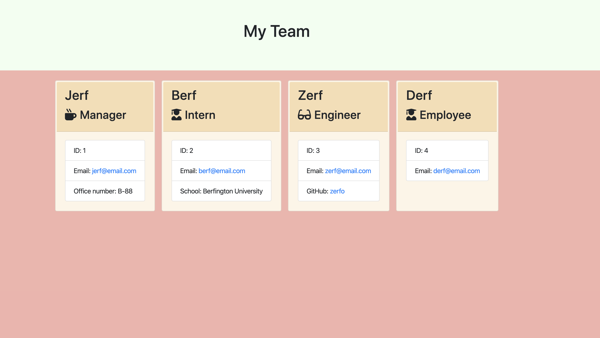

  # Team Profile Generator

  ## Description 
  
  A command line tool where users input employee information and an html page displaying employee summaries is generated accordingly.

  ## License 

  This repository is licensed under:  
  [![License: MIT] (https://img.shields.io/badge/License-MIT-yellow.svg)
  

  ## Table of Contents
  * [Description](#description)
  * [License](#license)
  * [Installation](#installation)
  * [Usage](#usage)
  * [Contributing](#contributing)
  * [Tests](#tests)
  * [Questions](#questions)

  ## Installation
  
  clone the repo pand run 'npm install' for the required dependencies

  ## Usage 
  
  run 'node index.js' in the integrated terminal of index.js

  ## Contributing 
  
  Shoot me an email, or do as you please. Open source.

  ## Tests
  
  Tests initialization and methods of the different employee classes. To test, run 'npm test' from the integrated terminal to test with Jest. 

  ## Questions 
  
  If you have any questions, send them my way on github @jackreedjackreed or send an email to jackr353@mgmail.com.

 ## Demo 

[Live Demo] https://drive.google.com/file/d/1IDDmUTcRI0vwIiSUbDQnO1FfHAoxSv35/view

  ## MIT License

  Permission is hereby granted, free of charge, to any person obtaining a copy
  of this software and associated documentation files (the "Software"), to deal
  in the Software without restriction, including without limitation the rights
  to use, copy, modify, merge, publish, distribute, sublicense, and/or sell
  copies of the Software, and to permit persons to whom the Software is
  furnished to do so, subject to the following conditions:

  The above copyright notice and this permission notice shall be included in all
  copies or substantial portions of the Software.

  THE SOFTWARE IS PROVIDED "AS IS", WITHOUT WARRANTY OF ANY KIND, EXPRESS OR
  IMPLIED, INCLUDING BUT NOT LIMITED TO THE WARRANTIES OF MERCHANTABILITY,
  FITNESS FOR A PARTICULAR PURPOSE AND NONINFRINGEMENT. IN NO EVENT SHALL THE
  AUTHORS OR COPYRIGHT HOLDERS BE LIABLE FOR ANY CLAIM, DAMAGES OR OTHER
  LIABILITY, WHETHER IN AN ACTION OF CONTRACT, TORT OR OTHERWISE, ARISING FROM,
  OUT OF OR IN CONNECTION WITH THE SOFTWARE OR THE USE OR OTHER DEALINGS IN THE
SOFTWARE.;
